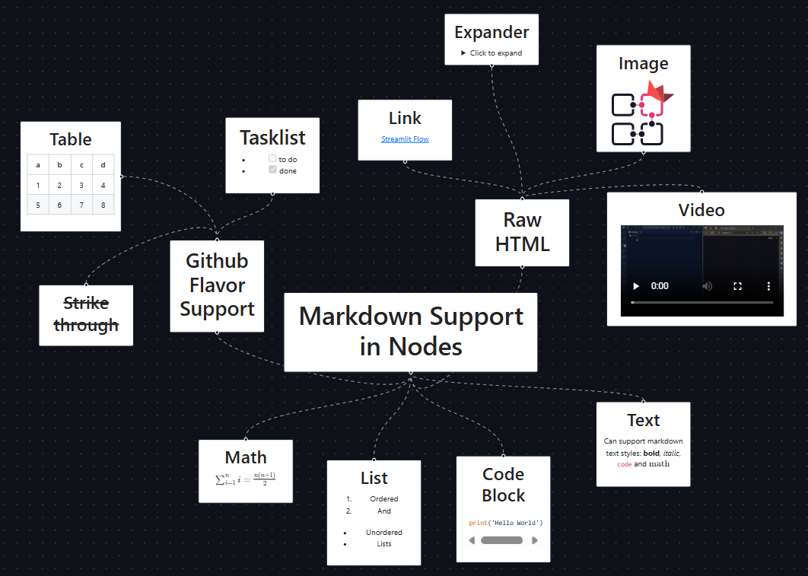

# Streamlit Flow
[](https://stflow.streamlit.app)


**Build beautiful, interactive flow diagrams: Powered by React Flow, Simplified by Streamlit.**

### 🎉 Version 1.2.9 is out now! 🎉

Introducing **Markdown Support in Nodes**! Now you are no longer limited to having text in your nodes. Use the features offered by Markdown and HTML to spice up your nodes.



*The `label` attribute on the `data` property of `SteamlitFlowNode` has been replaced by the `content` attribute, which accepts as input a string that can be either plain text, markdown, or raw HTML. For extened support, the `label` attribute still works, but is internally reassigned to the `content` attribute, but `label` will be depricated in the next release.*

##### Minor Changes

- Can optionally hide the `ReactFlow` watermark on the canvas.


## Features

- Create, edit and visualize beautiful flow diagrams.
- Add nodes and edges, move them around, pan and zoom.
- Edit node and edge properties.
- Easy to use Layouts - Layered, Tree, Force, Stress, Radial, Random, and Manual.
- Markdown Support in Nodes.
- Interactions with Streamlit - clicks on nodes and edges can be captured in Streamlit.


A demo for all these features can be found [here](https://stflow.streamlit.app).

## Installation

```bash
pip install streamlit-flow-component
```

## Running the example


#### Install the dependencies
```bash
git clone https://github.com/dkapur17/streamlit-flow.git
cd streamlit-flow
npm install --prefix streamlit_flow/frontend
```

#### Run the frontent
On the first terminal, run from the root of the repository
```bash
cd streamlit_flow/frontend
npm start
```

#### Run this Example Streamlit App
On the second terminal, run from the root of the repository
```bash
streamlit run example.py
```

## Change log

### Version 1.0.0

* **Overhauled State Management**: The component now manages the state of the flow diagram automatically. As such, it keeps track of changes to node positions, connections, and more.

* **Pane Context Menu**: Right-clicking on the canvas now opens a context menu, allowing you to add new nodes or reset the layout.

* **Node Context Menu**: Right-clicking on a node now opens a context menu, allowing you to edit or delete the node.

* **Edge Context Menu**: Right-clicking on an edge now opens a context menu, allowing you to edit or delete the edge.

* **Way more Layouts**: The layouts are now more extensive, including Tree, Layered, Force, Stress, Radial, Random and Manual. One can also make a custom layout by inheriting from the `Layout` class.

* **Hackable Python State**: The primary state management is done within the component, and the state can be read by Python. This is the intended usage. However, while not recommended, it is possible to modify the state from Python as well if the user wishes to.

### Version 0.6.0

* The initial release of the library, with the ability to visualize flow diagrams.
* Create nodes and edges, move them around, pan and zoom.
* Automatic Layered Layout Supported
* Interactions sent to Streamlit - The component returns the ID of the element that was clicked on.
